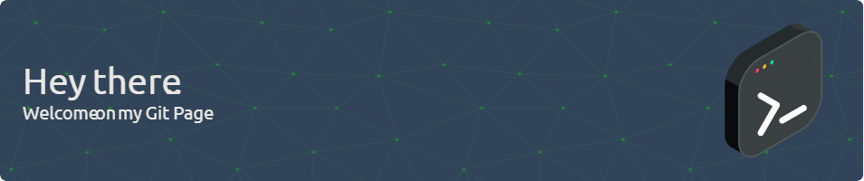

🌱 Pleasure in the job puts perfection in the work. ~ Aristotle

👨🏼‍💻⚙️Diving straight into edge tech!

## Languages and Tools

                                                       

## Trophies 

  

  

